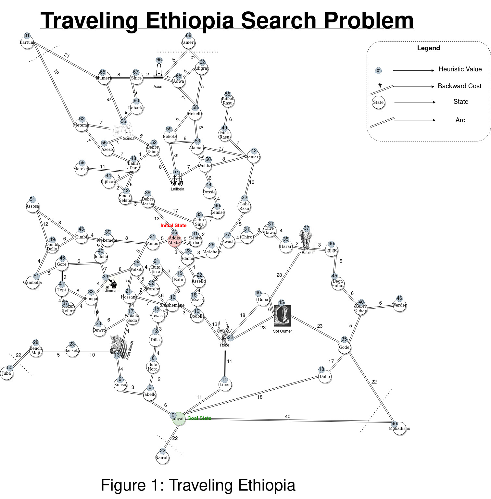

# Ethiopia Travelling Problem Solver

## Informed Search Algorithms - Configurable Search Platform

This repository contains a Python program that solves the travelling problem in Ethiopia using the A* search algorithm. The problem is similar to the traveling salesman problem, but it considers the map of Ethiopia and finds the optimal path from a starting city to a destination city.

## Assignment Question

- Enclosed a Model of a search problem, Traveling Ethiopia. 
- Write a working class that accept any strategy and Traveling Ethiopia problem, and return with a path/s from the initial state to the goal state/s. 
## Features

- A* search algorithm implementation for solving the travelling problem.
- Heuristic function based on straight-line distances to Moyale.
- Efficient priority queue implementation using heapq.
- Example usage with detailed comments for better understanding.
- Easily extensible for different maps or heuristics.

## Usage

To use the program, follow these steps:

1. Ensure you have Python installed on your system (version 3.x recommended).

2. Clone this repository to your local machine:

https://github.com/MyNimrod/AI-principles-and-Techniques.git

3. Navigate to the cloned directory:

cd AI-principles-and-Techniques/Informed_Search_Algorithm/

4. Run the program with the following command:

python3 A_star_search.py
     
         OR
Open A_Star_Search.ipynb using Jupyter Notebook

5. Follow the on-screen instructions to input the starting and destination cities.

6. The program will output the optimal path, its cost, and the number of states expanded during the search.

## Contributing

Contributions are welcome! If you find any bugs or want to suggest improvements, please open an issue or submit a pull request.
